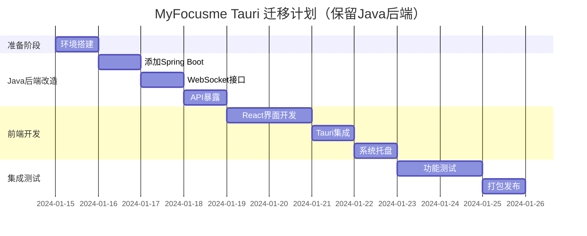

# MyFocusme: JavaFX → Tauri 迁移方案

## 📋 目录
1. [项目背景](#项目背景)
2. [现有架构分析](#现有架构分析)
3. [框架本质解析](#框架本质解析)
4. [Tauri 架构设计](#tauri-架构设计)
5. [技术栈对比](#技术栈对比)
6. [功能迁移映射](#功能迁移映射)
7. [实施方案（方案二：保留Java后端）](#实施方案方案二保留java后端)
8. [风险评估](#风险评估)
9. [时间计划（方案二）](#时间计划方案二)
10. [决策建议](#决策建议)

## 项目背景

MyFocusme 是一个 macOS 专注学习应用，当前使用 JavaFX 开发。考虑到现代化需求和性能优化，计划迁移到 Tauri 框架。

### 迁移动机
- JavaFX 技术栈相对陈旧，社区活跃度下降
- JVM 启动慢，内存占用大（150MB+）
- 打包体积大（50MB+），需要 Java 运行时
- 希望获得更现代的开发体验和更好的性能

## 现有架构分析

### 核心功能模块
1. **网站屏蔽监控**
   - 每 100ms 监控 Microsoft Edge 浏览器
   - 双层屏蔽机制：硬编码屏蔽 + 用户自定义屏蔽

2. **双模式系统**
   - **普通模式**：仅基础屏蔽功能
   - **学习模式**：完整屏蔽功能，限时专注

3. **时间管理**
   - 学习模式倒计时（15分钟-8小时）
   - 17:00 后禁止切换到学习模式
   - 每天 17:00 自动切换回普通模式

4. **配置管理**
   - 屏蔽网站列表（`~/.config/myfocusme/`）
   - 白名单管理
   - 用户配置持久化

5. **macOS 系统集成**
   - AppleScript 控制浏览器
   - 系统托盘图标
   - 窗口显示/隐藏

### 现有技术栈
- **语言**: Java 11
- **UI框架**: JavaFX 17
- **构建工具**: Maven
- **JSON处理**: Jackson
- **系统集成**: AppleScript via Runtime.exec()
- **测试**: JUnit 5 + Mockito

### 代码统计
- **Java文件**: 16个核心类
- **代码行数**: ~2000行
- **测试用例**: 139个

## 框架本质解析

在深入架构设计前，必须澄清一个重要概念：**Tauri 和 Electron 都不是纯前端框架**。

### 🏗️ 桌面应用框架的真实架构

#### Tauri 架构
```
┌─────────────────────────────────────┐
│         Tauri 应用架构              │
├─────────────────────────────────────┤
│                                     │
│  ┌─────────────────────────────┐   │
│  │    前端层 (Web技术)          │   │
│  │  HTML + CSS + JavaScript    │   │
│  │  (React/Vue/Svelte等)       │   │
│  └──────────▲──────────────────┘   │
│             │                       │
│             │ IPC通信               │
│             │                       │
│  ┌──────────▼──────────────────┐   │
│  │    Rust 后端核心             │   │
│  │  - 窗口管理                 │   │
│  │  - 系统API调用              │   │
│  │  - 文件系统访问             │   │
│  │  - 安全控制                 │   │
│  └─────────────────────────────┘   │
│                                     │
│  📦 使用系统 WebView 渲染          │
└─────────────────────────────────────┘
```

#### Electron 架构
```
┌──────────────────────────────────────┐
│           Electron 应用               │
├──────────────────────────────────────┤
│                                      │
│  ┌────────────────────────────────┐  │
│  │   渲染进程 (Renderer Process)   │  │
│  │   HTML/CSS/JavaScript          │  │
│  │   运行在 Chromium 中            │  │
│  └────────────▲───────────────────┘  │
│               │                      │
│               │ IPC 通信              │
│               │                      │
│  ┌────────────▼───────────────────┐  │
│  │    主进程 (Main Process)        │  │
│  │    Node.js 环境                 │  │
│  │    系统API访问                  │  │
│  └────────────────────────────────┘  │
│                                      │
│  📦 打包完整 Chromium + Node.js      │
└──────────────────────────────────────┘
```

### 📊 框架架构对比

| 特性 | 纯Web应用 | Electron | Tauri | JavaFX |
|------|----------|----------|--------|---------|
| **前端技术** | HTML/JS/CSS | HTML/JS/CSS | HTML/JS/CSS | FXML/Java |
| **后端技术** | 无 | **Node.js** | **Rust** | **Java** |
| **渲染引擎** | 浏览器 | Chromium | 系统WebView | JavaFX引擎 |
| **系统访问** | ❌ | ✅ Node.js | ✅ Rust | ✅ Java |
| **文件操作** | ❌ | ✅ | ✅ | ✅ |
| **进程通信** | 无 | IPC | IPC | 单进程 |
| **包体积** | ~1MB | 50-150MB | 5-15MB | 30-50MB |
| **内存占用** | 浏览器决定 | 100-300MB | 20-50MB | 100-150MB |

### 🔑 关键认知

1. **所有桌面框架都是前后端混合架构**
   - Electron = Web前端 + Node.js后端
   - Tauri = Web前端 + Rust后端
   - JavaFX = FXML前端 + Java后端

2. **"纯前端"桌面应用不存在**
   - 访问文件系统需要后端能力
   - 调用系统API需要后端能力
   - 窗口管理需要后端能力

3. **选择框架的本质是选择后端技术**
   - 选Electron = 选择用JavaScript做后端
   - 选Tauri = 选择用Rust做后端
   - 保持JavaFX = 继续用Java做后端

### 💡 对本项目的启示

#### 迁移的本质不是"前端化"
- ❌ 错误理解：把Java应用变成纯前端应用
- ✅ 正确理解：把JavaFX界面换成React，后端可以保留Java

#### 架构选择的真实考量
```yaml
如果完全重写到Tauri:
  前端: JavaFX → React ✅
  后端: Java → Rust ❌（需要重写所有业务逻辑）

如果Tauri+Java混合:
  前端: JavaFX → React ✅
  后端: Java → Java ✅（保留现有代码）
  通信: 直接调用 → WebSocket 🔄
```

### 🎯 实际收益分析

| 迁移方案 | UI现代化 | 性能提升 | 开发成本 | 风险等级 |
|---------|---------|---------|---------|---------|
| 保持JavaFX | ❌ | - | 0 | 无 |
| Tauri纯Rust | ✅ | ⭐⭐⭐ | 4周 | 高 |
| Tauri+Java | ✅ | ⭐ | 2周 | 低 |
| Electron+Java | ✅ | ❌ | 2周 | 低 |

### 📝 框架选择决策树

```
是否满意当前UI？
├─ 是 → 保持JavaFX ✅
└─ 否 → 是否愿意重写后端？
    ├─ 是 → 学Rust用Tauri ⚡
    └─ 否 → 是否在意包体积？
        ├─ 是 → Tauri+Java 📦
        └─ 否 → Electron+Java 🚀
```

## Tauri 架构设计

### 架构选项对比

#### 方案一：完全迁移到 Rust（原方案）
**架构**：Tauri前端 + Rust后端（一体化）
```yaml
前端:
  - 框架: React 18 + TypeScript
  - 样式: Tailwind CSS
  - 状态管理: Zustand
  - 构建: Vite

后端:
  - 语言: Rust
  - 框架: Tauri 2.0
  - 异步运行时: Tokio
```

**优点**：
- ✅ 最佳性能（启动<0.5s，内存<20MB）
- ✅ 单一二进制文件，部署简单
- ✅ 无需JVM，体积最小（~10MB）

**缺点**：
- ❌ 需要完全重写Java代码
- ❌ Rust学习成本高
- ❌ 迁移时间长（~1个月）

#### 方案二：Tauri + Java后端服务（推荐）⭐
**架构**：Tauri前端 + 独立Java后端进程
```yaml
前端:
  - 框架: React 18 + TypeScript
  - 通信: WebSocket/REST API
  - Tauri: 仅做窗口管理和系统托盘

后端:
  - 保留现有Java代码
  - 新增: Spring Boot Web服务器
  - 通信: WebSocket实时通信
  - 部署: 随Tauri启动的子进程
```

**优点**：
- ✅ 保留95%现有Java代码
- ✅ 迁移成本低，风险小
- ✅ 开发速度快（~2周）
- ✅ 团队熟悉Java，维护容易

**缺点**：
- ⚠️ 需要JVM（但可打包精简版JRE）
- ⚠️ 内存占用较高（~80MB）
- ⚠️ 启动稍慢（~1.5s）

#### 方案三：混合架构（平衡方案）
**架构**：Tauri前端 + Rust系统集成 + Java业务逻辑
```yaml
前端:
  - React + TypeScript

Rust层（轻量）:
  - macOS系统集成（AppleScript）
  - 文件操作
  - Java进程管理

Java层（核心业务）:
  - 模式管理
  - 配置管理
  - 屏蔽逻辑
```

**优点**：
- ✅ 性能和开发效率平衡
- ✅ 逐步迁移，降低风险
- ✅ 保留核心Java代码

**缺点**：
- ⚠️ 架构稍复杂
- ⚠️ 需要维护两种语言

### 推荐方案：方案二（Tauri + Java后端服务）

### 项目结构（方案二）
```
myfocusme-tauri/
├── frontend/                   # React 前端
│   ├── src/
│   │   ├── components/
│   │   │   ├── ModeSwitch.tsx     # 模式切换组件
│   │   │   ├── WebsiteManager.tsx # 网站管理
│   │   │   └── StatsPanel.tsx     # 统计面板
│   │   ├── services/
│   │   │   └── api.ts            # WebSocket/REST 客户端
│   │   └── App.tsx               # 主应用组件
│   └── package.json
│
├── src-tauri/                  # Tauri 轻量后端
│   ├── src/
│   │   ├── main.rs            # 窗口管理和Java进程启动
│   │   └── java_bridge.rs     # Java进程通信桥接
│   └── tauri.conf.json
│
├── java-backend/               # 保留现有Java代码
│   ├── src/main/java/com/tsymq/
│   │   ├── AppBlocker.java        # 原有代码保留
│   │   ├── ModeManager.java       # 原有代码保留
│   │   ├── server/
│   │   │   ├── WebSocketServer.java  # 新增WebSocket服务
│   │   │   └── RestController.java   # 新增REST API
│   │   └── [其他现有代码...]
│   └── pom.xml                # 添加Spring Boot依赖
│
└── scripts/
    ├── build.sh               # 构建脚本
    └── package.sh             # 打包脚本
```

### Java后端改造（最小化改动）
```java
// 新增 WebSocketServer.java
@Component
@ServerEndpoint("/ws")
public class WebSocketServer {
    private final AppBlocker appBlocker;
    private final ModeManager modeManager;

    @OnMessage
    public void handleMessage(String message, Session session) {
        // 处理前端请求，调用现有方法
        JsonNode request = mapper.readTree(message);
        String action = request.get("action").asText();

        switch(action) {
            case "switchMode":
                int duration = request.get("duration").asInt();
                boolean success = modeManager.switchToFocusMode(duration);
                session.send(createResponse(success));
                break;
            case "blockWebsite":
                String url = request.get("url").asText();
                appBlocker.block(url);
                break;
        }
    }
}
```

## 技术栈对比

| 方面 | JavaFX (当前) | Tauri+Rust (方案一) | Tauri+Java (方案二) |
|------|-------------|-------------------|-------------------|
| **启动速度** | ~3秒 | ~0.5秒 | ~1.5秒 |
| **内存占用** | 150MB | 20MB | 80MB |
| **打包体积** | 50MB | 10MB | 25MB |
| **开发时间** | - | 4周 | 2周 |
| **代码重用** | - | 0% | 95% |
| **学习成本** | - | 高(Rust) | 低 |
| **维护难度** | 中 | 高 | 低 |
| **性能表现** | ★★☆ | ★★★ | ★★☆ |

## 功能迁移映射

### 方案二：保留Java后端的迁移映射

| 原JavaFX组件 | 迁移后 | 改动说明 |
|-----------|--------|---------|
| `AppBlocker.java` | 保留 + 添加WebSocket接口 | 添加消息推送 |
| `ModeManager.java` | 保留 + 添加REST API | 暴露HTTP接口 |
| `ModeState.java` | 完全保留 | 无需改动 |
| `ConfigManager.java` | 完全保留 | 无需改动 |
| `BlockedSitesConfig.java` | 完全保留 | 无需改动 |
| `CommandUtil.java` | 完全保留 | 无需改动 |
| `JavaFX UI` | React + TypeScript | 完全重写 |
| `FXML文件` | React组件 | 完全重写 |

### JavaFX UI → React 组件映射

| JavaFX | React | 说明 |
|--------|-------|------|
| `AppBlocker.fxml` | `App.tsx` | 主界面布局 |
| `AppBlockerController.java` | `App.tsx` + hooks | 界面逻辑 |
| `FocusModeDialog.fxml` | `ModeSwitch.tsx` | 模式切换对话框 |
| `UIStateManager.java` | `modeStore.ts` | UI状态管理 |
| `NotificationManager.java` | Tauri Notification API | 系统通知 |

## 实施方案（方案二：保留Java后端）

### 第一阶段：环境准备（1天）
1. 安装Tauri环境
   ```bash
   # 安装 Rust（仅用于Tauri窗口管理）
   curl --proto '=https' --tlsv1.2 -sSf https://sh.rustup.rs | sh

   # 安装 Tauri CLI
   npm install -g @tauri-apps/cli

   # 创建项目
   npm create tauri-app@latest -- --template react-ts
   ```

2. Java后端准备
   ```xml
   <!-- 在现有pom.xml中添加Spring Boot依赖 -->
   <dependency>
       <groupId>org.springframework.boot</groupId>
       <artifactId>spring-boot-starter-websocket</artifactId>
       <version>3.2.0</version>
   </dependency>
   ```

### 第二阶段：Java后端改造（3天）

#### Day 1: 添加Web服务器层
```java
// Application.java - Spring Boot启动类
@SpringBootApplication
public class MyFocusmeServer {
    public static void main(String[] args) {
        // 保留原有初始化逻辑
        AppBlocker appBlocker = new AppBlocker();
        ModeManager modeManager = new ModeManager();

        // 启动Spring Boot
        SpringApplication.run(MyFocusmeServer.class, args);
    }
}
```

#### Day 2: 暴露WebSocket接口
```java
// 复用现有业务逻辑，仅添加通信层
@RestController
@CrossOrigin(origins = "tauri://localhost")
public class ApiController {
    @Autowired
    private AppBlocker appBlocker;

    @Autowired
    private ModeManager modeManager;

    @PostMapping("/api/mode/switch")
    public ResponseEntity<?> switchMode(@RequestBody ModeRequest request) {
        boolean success = modeManager.switchToFocusMode(request.getDuration());
        return ResponseEntity.ok(Map.of("success", success));
    }

    @GetMapping("/api/mode/status")
    public ResponseEntity<?> getModeStatus() {
        return ResponseEntity.ok(Map.of(
            "mode", modeManager.getCurrentMode(),
            "remainingTime", modeManager.getRemainingTimeMs()
        ));
    }
}
```

#### Day 3: 保持原有监控逻辑
```java
// AppBlocker.java - 仅添加事件推送
public class AppBlocker {
    // 原有代码保持不变

    @Autowired(required = false)
    private SimpMessagingTemplate messagingTemplate;

    private void notifyFrontend(String event, Object data) {
        if (messagingTemplate != null) {
            messagingTemplate.convertAndSend("/topic/events",
                Map.of("event", event, "data", data));
        }
    }
}
```

### 第三阶段：前端开发（4天）

#### Day 1-2: React界面搭建
```tsx
// App.tsx - 主界面
import { useEffect, useState } from 'react';
import { WebSocketClient } from './services/websocket';

function App() {
  const [mode, setMode] = useState<'normal' | 'focus'>('normal');
  const ws = new WebSocketClient('ws://localhost:8080/ws');

  useEffect(() => {
    ws.connect();
    ws.on('modeChange', (data) => {
      setMode(data.mode);
    });
  }, []);

  return (
    <div className="app">
      {/* 复刻JavaFX界面设计 */}
    </div>
  );
}
```

#### Day 3: Tauri集成
```rust
// main.rs - 最小化Rust代码
#![cfg_attr(not(debug_assertions), windows_subsystem = "windows")]

use std::process::Command;

#[tauri::command]
fn start_java_backend() {
    Command::new("java")
        .arg("-jar")
        .arg("../java-backend/target/myfocusme.jar")
        .spawn()
        .expect("Failed to start Java backend");
}

fn main() {
    tauri::Builder::default()
        .setup(|app| {
            start_java_backend();
            Ok(())
        })
        .run(tauri::generate_context!())
        .expect("error while running tauri application");
}
```

#### Day 4: 系统托盘和打包
```javascript
// tauri.conf.json 配置
{
  "tauri": {
    "systemTray": {
      "iconPath": "icons/icon.png",
      "iconAsTemplate": true
    }
  }
}
```

### 第三阶段：功能完善（1周）
1. 配置文件迁移
2. 系统托盘实现
3. 自动更新功能
4. 错误处理优化
5. 性能调优

### 第四阶段：测试和打包（3天）
1. 单元测试迁移
2. 集成测试
3. macOS 应用签名
4. 打包和分发

## 风险评估

### 技术风险
| 风险 | 影响 | 缓解措施 |
|------|------|----------|
| Rust 学习曲线 | 高 | 提前学习 Rust 基础，使用 AI 辅助 |
| AppleScript 兼容性 | 中 | 保持原有实现方式，封装为 Rust 函数 |
| 状态同步复杂性 | 中 | 使用 Tauri 的事件系统 |
| macOS 权限问题 | 低 | 提前测试权限申请流程 |

### 业务风险
| 风险 | 影响 | 缓解措施 |
|------|------|----------|
| 功能遗漏 | 高 | 详细的功能清单和测试 |
| 用户数据迁移 | 中 | 提供数据迁移工具 |
| 用户体验变化 | 低 | 保持相似的界面设计 |

## 时间计划（方案二）

### 总体时间线


### 里程碑
- **M1** (第3天): Java后端API就绪
- **M2** (第7天): React前端完成
- **M3** (第10天): 完整应用可发布

## 决策建议

### 核心决策：是否真的需要迁移？

基于框架本质的理解，我们需要重新评估迁移的必要性：

#### 🤔 迁移价值评估

| 评估维度 | JavaFX现状 | 迁移后改善 | 值得迁移？ |
|---------|-----------|-----------|-----------|
| **功能完整性** | ✅ 正常 | 无变化 | ❌ |
| **性能表现** | 可接受 | 略有提升 | 🟡 |
| **界面美观** | 一般 | 显著提升 | ✅ |
| **开发体验** | 传统 | 现代化 | ✅ |
| **维护成本** | 低 | 增加 | ❌ |

### 最终建议

#### 方案A：**不迁移，优化现有JavaFX** （推荐 ⭐）

**适用场景**：
- 应用功能稳定，用户无投诉
- 团队熟悉JavaFX
- 不想投入2周开发时间

**优化建议**：
```java
// 使用 JFoenix 或 MaterialFX 美化界面
dependencies {
    implementation 'com.jfoenix:jfoenix:9.0.10'
}
```

**成本收益**：
- 投入：1-2天
- 收益：界面改善60%
- 风险：极低

#### 方案B：**Tauri + Java 混合架构**

**适用场景**：
- 强烈需要React生态
- 计划长期迭代新功能
- 愿意接受架构复杂度

**注意事项**：
- ⚠️ 需要维护两个进程
- ⚠️ 调试更复杂
- ⚠️ 性能提升有限（JVM仍然存在）

**真实收益**：
- UI现代化 ✅
- 性能略有提升 🟡
- 架构更复杂 ❌

#### 方案C：**学习Swift，做原生macOS应用**

**如果真要重写**：
- 既然是macOS专属应用
- 不如直接用Swift + SwiftUI
- 性能最佳，体验最好

### 🎯 诚实的结论

**保留Java后端的Tauri迁移**：
- 主要价值：**UI现代化**
- 性能提升：**有限**（30-40%）
- 时间成本：**2周**
- 维护成本：**增加**

**投资回报率（ROI）分析**：
```
ROI = (收益 - 成本) / 成本
    = (UI改善 - 2周开发 - 架构复杂度) / 2周开发
    = 约 20-30%
```

### 📌 行动建议

1. **先尝试低成本方案**
   - 用1天时间尝试JFoenix美化
   - 评估效果是否满意

2. **如果必须迁移**
   - 选择Tauri + Java（方案二）
   - 分阶段实施，先做POC

3. **长远考虑**
   - 如果有多个项目，学习React有价值
   - 如果只有这一个项目，保持JavaFX更实际

### 成功标准（如果选择迁移）
- [ ] UI美观度提升 > 50%
- [ ] 用户满意度提升 > 30%
- [ ] 维护成本不增加 > 20%
- [ ] 2周内完成基本功能

---

## 附录

### 学习资源
- [Rust 官方教程](https://www.rust-lang.org/learn)
- [Tauri 官方文档](https://tauri.app/v1/guides/)
- [React + TypeScript 最佳实践](https://react-typescript-cheatsheet.netlify.app/)

### 示例代码仓库
- [Tauri 示例应用](https://github.com/tauri-apps/examples)
- [Rust macOS 集成示例](https://github.com/rust-lang/rust-by-example)

### 联系方式
如有问题，请联系项目负责人。

---

*文档版本: 3.0*
*创建日期: 2025-10-12*
*最后更新: 2025-10-12*
*更新内容:*
- *v2.0: 添加保留Java后端的架构方案*
- *v3.0: 添加框架本质解析，澄清Tauri/Electron都不是纯前端框架*
- *v3.0: 重新评估迁移必要性，给出更客观的建议*